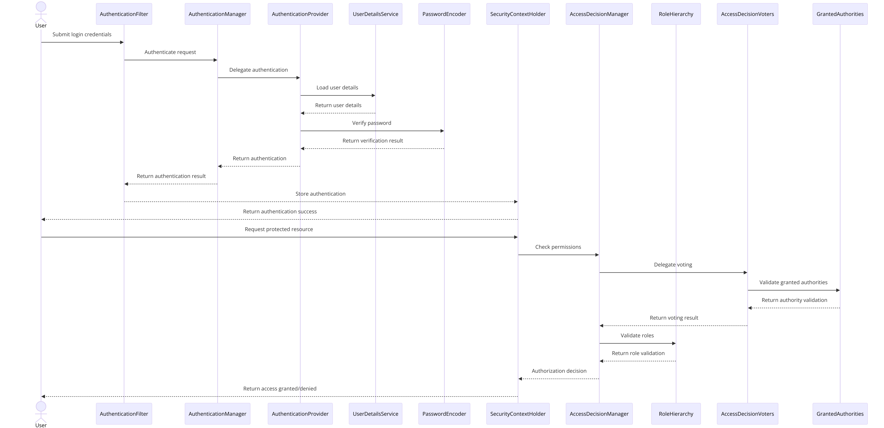

### **Step 1: Core Concepts in Spring Security**

Spring Security revolves around two major aspects:

1. **Authentication:** Determines if a user is who they claim to be.
    - Example: Logging in with a username and password.
2. **Authorization:** Determines what a user is allowed to do.
    - Example: Granting access to specific resources based on roles (e.g., only admins can access the admin dashboard).

In Spring Security:
- Authentication ensures the user is legitimate.
- Authorization ensures the user has the correct permissions.

---

### **Step 2: Key Components of Spring Security**

1. **AuthenticationFilter:**
    - Intercepts requests to handle login (or authentication) logic.
    - Captures credentials (like username and password) and sends them to the **AuthenticationManager**.

2. **AuthenticationManager:**
    - Delegates the authentication process to one or more **AuthenticationProviders**.
    - If no provider supports the given authentication, it throws an error.

3. **AuthenticationProvider:**
    - Performs the actual authentication by verifying the credentials.
    - Calls a **UserDetailsService** to load user-specific data from a database or memory.
    - Verifies the password using a **PasswordEncoder**.

4. **UserDetailsService:**
    - Retrieves user information (e.g., username, password, roles) based on the login credentials.

5. **PasswordEncoder:**
    - Ensures the password is encrypted (e.g., using `BCrypt`) for secure storage and verification.

6. **SecurityContextHolder:**
    - Stores the authenticated user’s details (e.g., username, roles) for the duration of a session.
    - This context is used to enforce authorization decisions.

7. **AccessDecisionManager:**
    - Manages authorization by checking if the authenticated user has the required permissions to access a resource.
    - Works with **AccessDecisionVoters** to decide access based on roles, authorities, or other policies.

---

### **Step 3: Authentication Flow**

Let’s follow the **authentication process** step-by-step (as visualized in the image):

#### 1. **User Submits Login Credentials**
- The user sends their username and password to the login endpoint.

#### 2. **Authentication Filter**
- The `AuthenticationFilter` intercepts the request and captures the credentials.
- It creates an `Authentication` object (containing the username and password) and sends it to the **AuthenticationManager**.

#### 3. **AuthenticationManager**
- The `AuthenticationManager` delegates authentication to one or more **AuthenticationProviders**.

#### 4. **AuthenticationProvider**
- The `AuthenticationProvider` validates the credentials:
    - Calls the `UserDetailsService` to load user details (e.g., username, hashed password, and roles).
    - Uses the `PasswordEncoder` to verify the password (e.g., compares the hashed password stored in the database with the provided password).
- If successful, it returns an `Authentication` object containing user details and authorities.

#### 5. **Authentication Success**
- The `AuthenticationManager` returns the authenticated user to the `AuthenticationFilter`.
- Spring Security stores the authenticated user in the **SecurityContextHolder** for future reference.

#### 6. **Access to Protected Resources**
- When the user makes a request to a protected resource:
    - Spring Security checks the `SecurityContextHolder` for the authenticated user’s details.
    - Calls the **AccessDecisionManager** to verify if the user has permission to access the resource.

---

### **Step 4: Authorization Flow**

The **authorization process** determines whether a user can access a specific resource. Here’s how it works:

#### 1. **Request Protected Resource**
- The user sends a request to a secured endpoint (e.g., `/admin/dashboard`).

#### 2. **Check SecurityContextHolder**
- Spring Security retrieves the authenticated user’s details (e.g., roles) from the `SecurityContextHolder`.

#### 3. **AccessDecisionManager**
- The `AccessDecisionManager` evaluates if the user is authorized to access the resource.
- It works with **AccessDecisionVoters** to "vote" on the user’s access rights based on roles, permissions, or policies.

#### 4. **Role Validation**
- If the user has the necessary role (e.g., `ROLE_ADMIN`), access is granted.
- Otherwise, access is denied.

---

### **Step 5: Key Security Classes**

Here’s a breakdown of the critical classes and their responsibilities:

| **Component**              | **Responsibility**                                                                 |
|-----------------------------|-------------------------------------------------------------------------------------|
| **AuthenticationManager**   | Orchestrates the authentication process by delegating to `AuthenticationProvider`. |
| **AuthenticationProvider**  | Authenticates the user by verifying credentials.                                   |
| **UserDetailsService**      | Loads user-specific details (e.g., username, password, roles) from a data source.  |
| **PasswordEncoder**         | Ensures secure storage and verification of passwords.                              |
| **SecurityContextHolder**   | Stores the authenticated user’s security context for the session.                  |
| **AccessDecisionManager**   | Handles authorization decisions.                                                   |

---

### **Step 6: Common Security Concepts**

1. **CSRF Protection:**
    - Protects against Cross-Site Request Forgery attacks.
    - Enabled by default in Spring Security.
    - Validates that requests are from trusted origins by using a CSRF token.

2. **Session Management:**
    - Spring Security uses sessions to store the user’s authentication details.
    - You can customize session policies (e.g., allow only one session per user).

3. **Role Hierarchies:**
    - You can define role hierarchies (e.g., `ADMIN` > `USER`) so that higher roles inherit permissions of lower roles.

4. **Exception Handling:**
    - Spring Security provides handlers for login failures, access denials, etc.

---

### **Step 7: End-to-End Example**

Let’s visualize the flow with an example:

#### 1. **Scenario**
- A user tries to access `/admin/dashboard`.
- The user submits their username and password.

#### 2. **Process**
- The credentials are captured by the `AuthenticationFilter` and sent to the `AuthenticationManager`.
- The `AuthenticationManager` delegates to the `AuthenticationProvider`.
- The `AuthenticationProvider`:
    - Calls `UserDetailsService` to load the user’s details from the database.
    - Uses `PasswordEncoder` to verify the password.
- If successful, Spring Security stores the user in the `SecurityContextHolder`.

#### 3. **Access Decision**
- The user requests `/admin/dashboard`.
- Spring Security checks the user’s roles in `SecurityContextHolder`.
- The `AccessDecisionManager` verifies that the user has `ROLE_ADMIN`.
- If authorized, access is granted.

---

### **Summary**

- **Authentication:** Verifies the user's identity.
- **Authorization:** Grants or denies access to resources.
- **SecurityContextHolder:** Holds the user’s authentication and authorization details.
- **AuthenticationManager & Providers:** Perform authentication.
- **AccessDecisionManager & Voters:** Handle authorization.
- **UserDetailsService:** Loads user-specific data.
- **PasswordEncoder:** Encrypts and verifies passwords securely.
- **CSRF Protection:** Prevents CSRF attacks.
- **Session Management:** Manages user sessions securely.
- **Role Hierarchies:** Define role relationships for permissions.
- **Exception Handling:** Provides handlers for security-related exceptions.
- **End-to-End Example:** Visualizes the authentication and authorization flow.
- **Key Security Classes:** Overview of critical Spring Security components.
- **Common Security Concepts:** CSRF protection, session management, role hierarchies, and exception handling.
- **Security in Spring Security:** Ensures secure authentication and authorization in Spring applications.
- **Secure Your Application:** Implement robust security measures to protect your application and users.
- **Stay Informed:** Keep up with the latest security practices and updates in Spring Security.
- **Secure Coding Practices:** Follow secure coding practices to prevent security vulnerabilities.

---

### **Shema of Spring Security**

